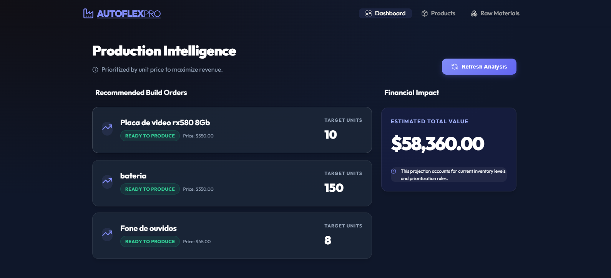

# Autoflex - Sistema de Controle de Produção

Este projeto é um sistema completo para controle de produção e estoque de matérias-primas, desenvolvido como um teste técnico. O sistema conta com um algoritmo inteligente que sugere ordens de produção baseadas no estoque disponível e na priorização por valor de mercado (preço).

## 📺 Demonstração em Vídeo


## 📸 Screenshots

### Dashboard Principal



---

## 🚀 Arquitetura e Tecnologias

- **Backend**: Java 17 com Spring Boot 3.
- **Frontend**: React 18, Redux Toolkit e Vite.
- **Banco de Dados**: Oracle Database XE.
- **Estilização**: CSS Moderno com foco em UX/UI (Glassmorphism).
- **Documentação API**: Swagger/OpenAPI.

---

## 🧠 Algoritmo de Sugestão de Produção

O coração do sistema é um serviço que:

1. Ordena os produtos do **maior para o menor preço**.
2. Calcula a quantidade máxima que pode ser produzida de cada item com o estoque atual.
3. Consome um **estoque virtual** durante o cálculo para garantir que a sugestão de um produto valioso não "roube" material que já foi alocado para outro ainda mais valioso.

---

## 🛠️ Como Executar o Projeto

### 1. Banco de Dados (Oracle)

> [!IMPORTANT]
> **Aviso de Conflito de Portas**: Caso você tenha o Oracle XE instalado localmente e tente rodar o Docker simultaneamente, haverá um conflito na porta **1521**.
>
> Durante o desenvolvimento, utilizei uma instalação local do Oracle. No entanto, o projeto já está totalmente configurado com Docker para facilitar a portabilidade.

**Opção A (Instalação Local):**
Certifique-se de que o Oracle XE está rodando e as credenciais batem com o `application.properties`.

**Opção B (Docker):**

```bash
docker-compose up -d
```

### 2. Backend

```bash
cd backend
mvn spring-boot:run
```

Acesse a documentação Swagger em: `http://localhost:8080/swagger-ui.html`

### 3. Frontend

```bash
cd frontend
npm install
npm run dev
```

---

## 📝 Relato de Desenvolvimento

### ⚠️ Dificuldades Encontradas

- **Configuração do Oracle XE**: Ajustar as permissões de usuário (SYS as SYSDBA) e garantir que as `sequences` funcionassem corretamente para a geração automática de IDs através do JPA.
- **Integração de Dados Complexos**: Lidar com relações Many-to-Many entre Produtos e Materiais, garantindo que a exclusão de um registro não deixasse "órfãos" no banco de dados.

### ✅ Como foram resolvidas

- **Configuração do Banco**: Implementação do Flyway para gerenciar as migrações (V1\_\_Initial_Schema.sql), garantindo que a estrutura do banco seja criada de forma idêntica em qualquer ambiente.
- **Integridade de Dados**: Adição de validações no backend para impedir a exclusão de materiais que ainda estão vinculados a produtos ativos, evitando erros de chave estrangeira.

### ➕ Pontos Positivos

- **Interface Moderna (SaaS)**: O uso de Glassmorphism e micro-animações elevou o nível visual do projeto, tornando-o muito superior a um MVP simples.
- **Performance do Algoritmo**: A lógica de consumo de estoque virtual permite cálculos precisos de produção em milissegundos.

### ➖ Pontos Negativos

- **Dependência de Porta**: A dependência rígida da porta 1521 do Oracle pode ser um incômodo para quem já possui outras instâncias de banco de dados rodando.
- **Complexidade de Setup Inicial**: Devido ao peso do Oracle XE, o primeiro carregamento do ambiente pode ser lento em máquinas com menos recursos.

---

Desenvolvido por **Adriel Luniere**.
